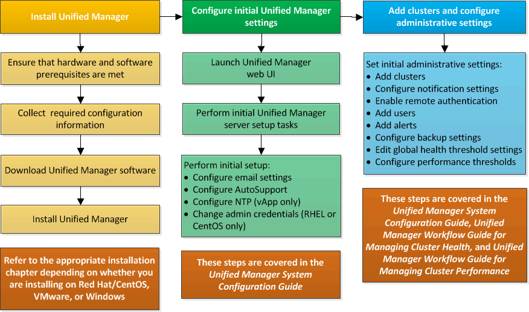

= Overview of the installation sequence
:icons: font
:imagesdir: ../media/

[.lead]
The installation workflow describes the tasks that you must perform before you can use Unified Manager.

The chapters of this installation guide describe each of the items shown in the workflow below.

