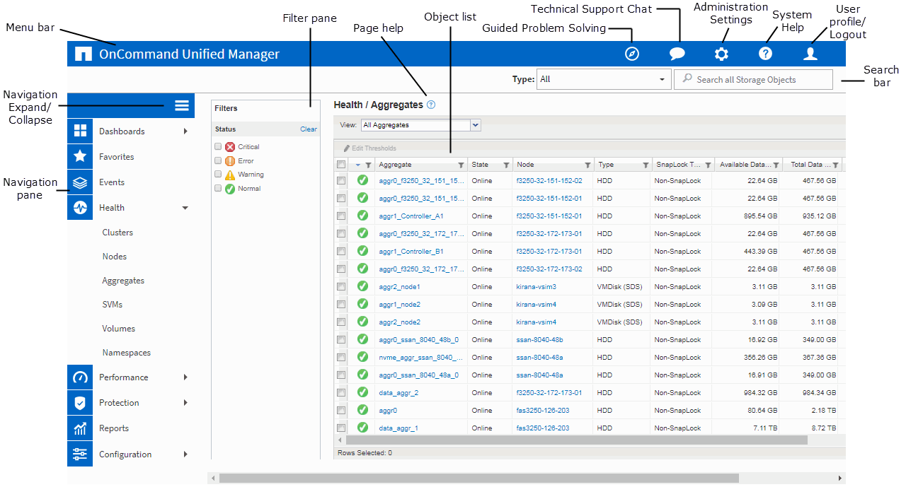

= Typical window layouts
:icons: font
:imagesdir: ../media/

[.lead]
Understanding the typical window layouts helps you to navigate and use OnCommand Unified Manager effectively. Most Unified Manager windows are similar to one of two general layouts: object list or details. The recommended display setting is at least 1280 by 1024 pixels.

Not every window contains every element in the following diagrams.

== Object list window layout

== Object details window layout

image::../media/object-details.gif[]
