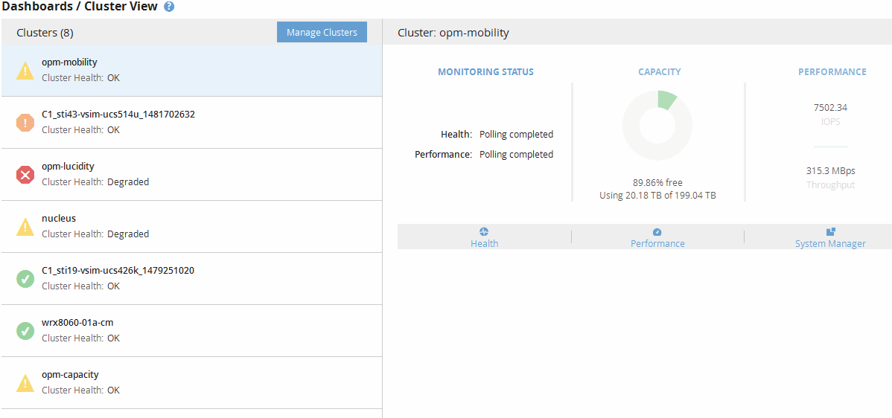

= Understanding the Cluster View dashboard
:icons: font
:imagesdir: ../media/

[.lead]
The Unified ManagerCluster View overview dashboard provides high-level information about the health of the clusters you are managing. The Cluster View dashboard consists of two major sections: Managed Clusters (on the left) and Cluster Details (on the right).

The following image shows an example of a Unified ManagerCluster View dashboard that is monitoring eight clusters:

The status icon next to each cluster name can be in the following states:

* Critical (image:../media/sev_critical_um60.png[Icon for event severity – critical]): One or more active critical events have been reported for the cluster.
* Error (image:../media/sev_error_um60.png[Icon for event severity – error]): One or more active error events have been reported for the cluster.
* Warning (image:../media/sev_warning_um60.png[Icon for event severity – warning]): One or more active warning events have been reported for the cluster.
* Normal (image:../media/sev_normal_um60.png[Icon for event severity – normal]): No active events have been reported for the cluster.

[NOTE]
====
The color indicates whether active (new or acknowledged) events exist for the object. Events that are no longer active, called obsolete events, do not affect the color of the icon.
====

To display additional information about a cluster, you can perform one of the following actions:

* You can click a cluster name to display overview information on the monitoring status, capacity status, and performance status of the cluster.
* You can click *Manage Clusters* to display the Configuration/Cluster Data Sources page, where you can view detailed status information for all the clusters being managed by this instance of Unified Manager.
