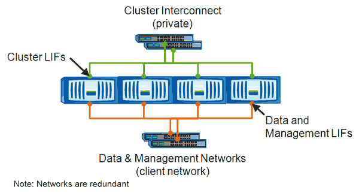

= Moving LIFs manually
:icons: font
:imagesdir: ../media/

[.lead]
storage virtual machines (SVMs)contain data volumes and one or more logical interfaces (LIFs) through which the SVM provides data to the clients. You can move data LIFs from one physical port to another within the same SVM. You might want to do this to improve load balancing or assist with maintenance operations and performance tuning.

== About this task

The following types of LIFs exist:

* Data LIFs: Associated with a SVM and used for communicating with clients.
* Cluster Management LIFs: Used for managing nodes, SVMs, and the cluster itself.
* Cluster LIFs: Used for intracluster traffic.
* Intercluster LIFs: Used for communication between clusters.
* Intracluster LIFs: Used for communication between HA pairs.
* SVM Management LIFs: Data LIFs associated with a SVM and used for managing that SVM.

This workflow describes how to move data LIFs. This applies to NAS (NFS and CIFS) LIFs, but not to SAN (FC and iSCSI) LIFs.

[NOTE]
====
When moving a LIF connected to CIFS shares, clients accessing the CIFS shares will be disconnected. Any read or write requests to the CIFS shares will be disrupted.
====

[NOTE]
====
For information about how to move other types of LIFs, including details about moving LIFS connected CIFS shares, see the ONTAP networking documentation.
====

You can perform the following basic actions related to data LIFs:

* Display all the data LIFs.
* Identify the busiest LIFs.
* Identify the best node to accept a busy LIF.
* Modify the home port or node for a LIF to change its preferred location in the cluster.
+
You should move a LIF rather than migrate a LIF for a more lasting change. To return to the original home port, you should revert the LIF.

* Migrate a data LIF to another port for a temporary change that might be used if the home port or node has a problem or is undergoing scheduled maintenance.
* Revert a data LIF to its home port.
