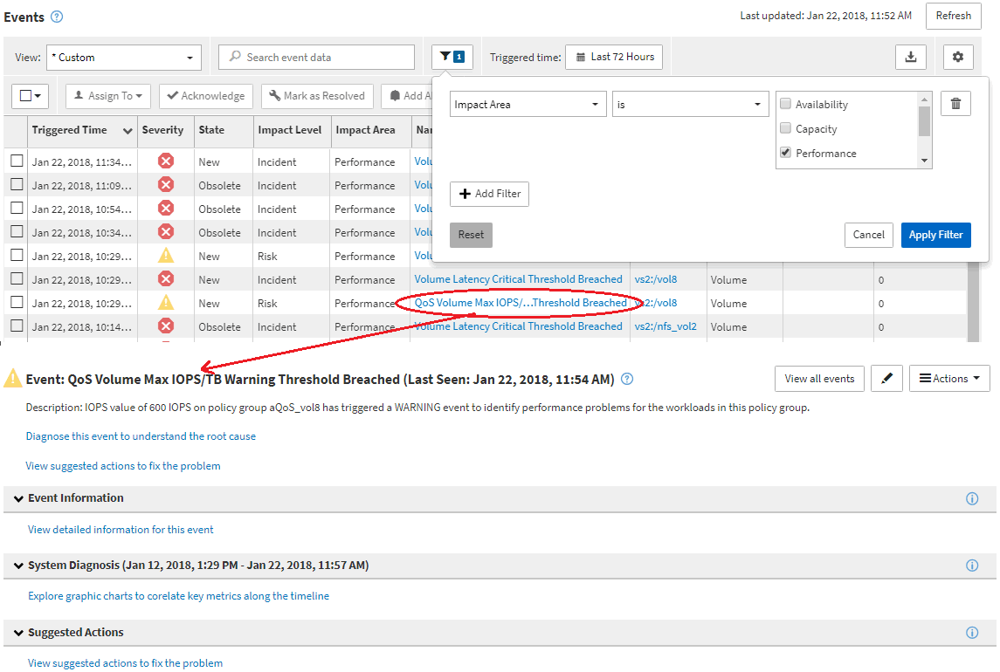

= Event investigation navigation
:icons: font
:imagesdir: ../media/

[.lead]
The Unified Manager event detail pages provide you with an in-depth look at any performance event. This is beneficial when investigating performance events, when troubleshooting, and when fine-tuning system performance.

Depending on the type of performance event, you might see one of two types of event detail pages:

* Event details page for user-defined and system-defined threshold policy events
* Event details page for dynamic threshold policy events

This is one example of an event investigation navigation.

. In the left navigation pane, click *Events*.
. In the Events inventory page, click the filter button and select *Performance* in the Impact Area to filter the list of events.
. Click the name of the event that you want to investigate and the Event details page is displayed.
. Expand any of the areas, such as Suggested Actions, to view more details about the event that may help you resolve the issue.

