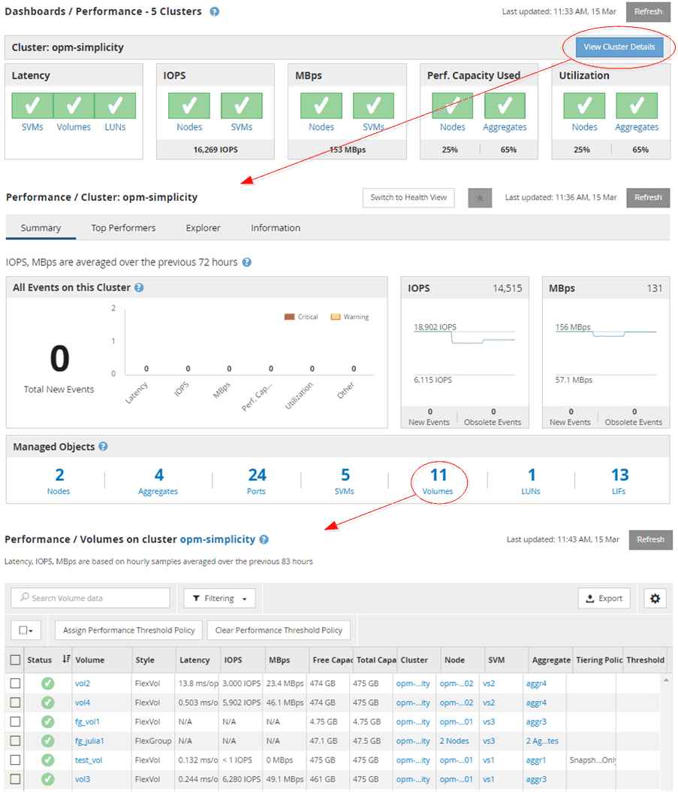

= Monitor cluster object navigation
:icons: font
:imagesdir: ../media/

[.lead]
Unified Manager enables you to monitor the performance of all objects in any cluster managed by Unified Manager. Monitoring your storage objects provides you with an overview of cluster and object performance, and includes performance event monitoring. You can view performance and events at a high level, or you can further investigate any details of object performance and performance events.

This is one example of many possible cluster object navigations:

. From the Dashboards/Performance page, identify a cluster you want to investigate and navigate to the selected cluster's landing page.
. From the Performance/Cluster Summary page, identify the cluster object you want to investigate and navigate to that object's inventory page. In this example, *Volumes* is selected to display the Performance/Volumes inventory page.

